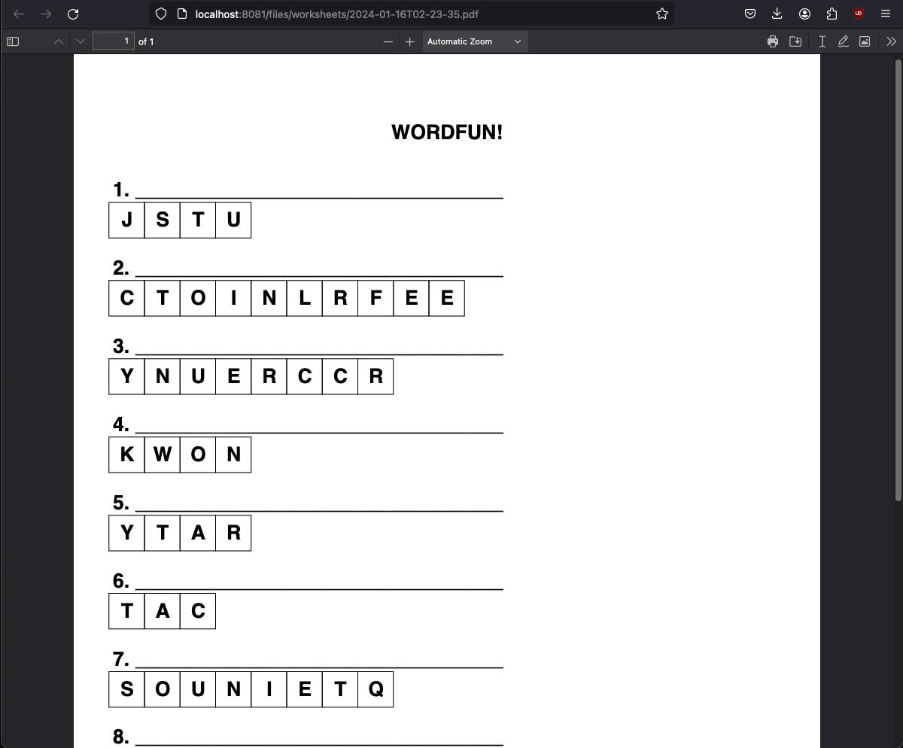

# Wordfun!

## Description

Wordfun! is an entertaining game designed to help elementary school children with their spelling. The frontend is written in TypeScript React. The backend is written in Go. This application utilizes the [Google Cloud Text-to-Speech API](https://cloud.google.com/text-to-speech) to generate audio files for words.

## Usage

When the website is launched, a random lesson is presented to the user. Users can navigate either by clicking the "Previous Word" or "Next Word" buttons to traverse the lesson, or they can click on the left pane. The left pane contains one box for each word in the lesson. Lines composed of dashes indicate the relative length of the words. 

When a word is chosen, or when the lesson launches (auto-selecting the first word), the audio file for that word will play automatically. The user can click "Show Letters" to reveal a letter bank. The letter bank is updated in real time as the user types. To spell the word, the user must click the first box (or any box) in the word. Input is evaluated as the user types. The border will turn green and the box will disable if the letter is correct. The border will turn red and the box will remain enabled until the user successfully chooses the letter. When a correct letter is entered, the associated letter in the letter bank is crossed out with a strikethrough styling. 

User input also causes a re-render of the large emoji at the bottom. When the word remains in an incorrect state, the emoji is chosen from a "negative emoji" bank.

When the entire word is complete, confetti will rain down from the top of the screen. The emoji will update to be "positive". 

## Worksheet Mode

A feature currently in development is Worksheet Mode. For now, clicking the "Worksheet" button will generate a PDF worksheet with a randomized letter bank. The intent is for this worksheet to be printed and completed by hand. As the feature evolves, clicking "Worksheet" will transition the frontend into a summarized version of the full game. The audio is still used for Worksheets, so it will eventually be combined on a single page for ease of use.

## Uploading words

This application does not ship with any audio files. Lessons are composed by reading the store of audio files and composing lessons from them. The words are not stored in a database. You will need a Google API key to utilize Google's Text to Speech API. Once the Google API key is set and the credentials.json file is appropriately referenced in an environment variable, a simple frontend tool is available to faciliate mass-generation of audio files. Run the application and navigate to /upload. 

If you use another API, you may do so. How the files are generated is not relevant to the functioning of this application. The backend provides this option as a convenience if you wish to utilize Google's Text to Speech API. Once the audio files are generated and in the proper directory, lessons can be generated, whatever the source. See the sample_envs.sh file for more information.

## Lesson Details

The backend generates lessons composed of 10 words total, with the following criteria:

1. Two words with a length less than four characters
2. Five words with a length of four to six characters
3. Three words with a length of seven or more characters

Additionally, completed words are stored in a Postgres database. When the lesson is built, words that were recently successfully spelled are ignored. Completed lessons are also persisted, although in the current version the UI does not support viewing them.